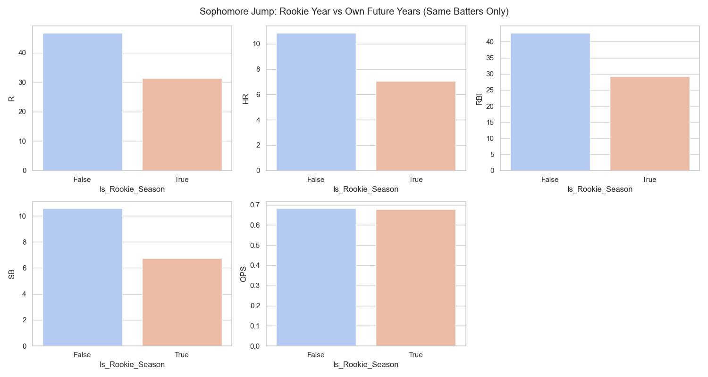
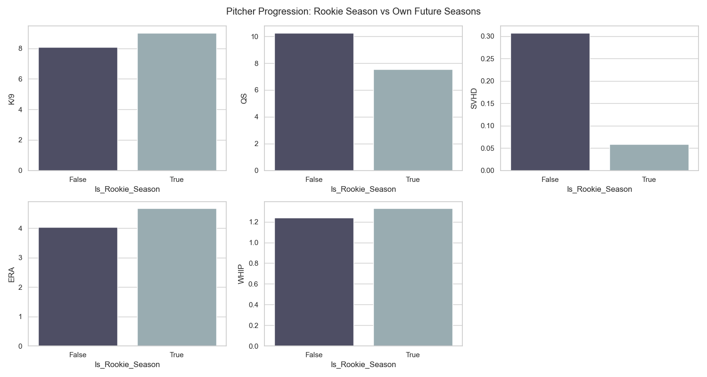

## Project Overview
Is it mathematically sound to intentionally draft rookies in a standard 5x5 Head-to-Head Fantasy Baseball league? We crossed daily MLB box scores from 2023-2025 against ESPN historical data logs to definitively map true categorical value-add for rookie seasons, comparing them entirely against an average veteran baseline.

---

### Key Features
- **Historical Age Mapping**: Dynamically generated via `pandas.read_html` scrapes from ESPN's legacy stat logs to determine every player's exact `Rookie_Year` constraint.
- **True Box Score Evaluation**: Bypassing point projections, players were strictly assessed at a per-category level (R, HR, RBI, SB, OPS; K/9, QS, SVHD, ERA, WHIP).
- **Veterans vs. Rookies Benchmark**: Minimum thresholds of 100 ABs (Hitters) or 16.2 IP (Pitchers) isolated true everyday contributors from September call-up noise.

---

### Findings & Charts

#### 1. Batting Statistics
At the aggregate level, the typical rookie season naturally falls behind an eligible veteran due to raw playing time limitations, slumps, and platoon adjustments. Across 2023-2025 (minimum 100 ABs), the Average Veteran produces:
- **.700 OPS** | **12.5 HR** | **47.6 Runs** | **45.8 RBI** | **7.8 SB**

Conversely, aggregate rookie averages lagged structurally across counting stats. 

#### 2. The Elite Exception
However, the top echelon of prospects matched or violently exceeded positional baselines, proving that gambling on undisputed top-10 system bats operates flawlessly within 5x5 restrictions:

| Rank | Player Name | Rookie Year | Runs | HR | RBI | SB | OPS | +/- Vet OPS |
|:---:|:---|:---:|:---:|:---:|:---:|:---:|:---:|:---:|
| **1** | Davis Schneider | 2023 | 23 | 8 | 20 | 1 | **1.008** | +.294 |
| **2** | Nick Kurtz | 2025 | 90 | 36 | 86 | 2 | **1.002** | +.288 |
| **3** | Roman Anthony | 2025 | 48 | 8 | 32 | 4 | **.859** | +.145 |
| **4** | Daylen Lile | 2025 | 51 | 9 | 41 | 8 | **.845** | +.131 |
| **5** | Jakob Marsee | 2025 | 28 | 5 | 33 | 14 | **.842** | +.128 |
| **6** | Zack Gelof | 2023 | 40 | 14 | 32 | 14 | **.840** | +.126 |
| **7** | Colson Montgomery | 2025 | 43 | 21 | 55 | 0 | **.840** | +.126 |
| **8** | Edouard Julien | 2023 | 60 | 16 | 37 | 3 | **.839** | +.126 |
| **9** | Jackson Merrill | 2024 | 77 | 24 | 90 | 16 | **.826** | +.112 |
| **10** | Noelvi Marte | 2023 | 15 | 3 | 15 | 6 | **.822** | +.108 |
| **11** | Wander Franco | 2023 | 65 | 17 | 58 | 30 | **.819** | +.105 |
| **12** | Drake Baldwin | 2025 | 56 | 19 | 80 | 0 | **.810** | +.096 |
| **13** | Christian Encarnacion-Strand | 2023 | 29 | 13 | 37 | 2 | **.805** | +.091 |
| **14** | Stone Garrett | 2023 | 40 | 9 | 40 | 3 | **.801** | +.087 |
| **15** | Jackson Chourio | 2024 | 80 | 21 | 79 | 22 | **.791** | +.077 |
| **16** | Jordan Walker | 2023 | 51 | 16 | 51 | 7 | **.787** | +.073 |
| **17** | Kyle Teel | 2025 | 38 | 8 | 35 | 3 | **.786** | +.072 |
| **18** | Jared Triolo | 2023 | 30 | 3 | 21 | 6 | **.785** | +.071 |
| **19** | Masataka Yoshida | 2023 | 71 | 15 | 72 | 8 | **.783** | +.069 |
| **20** | James Wood | 2024 | 43 | 9 | 41 | 14 | **.781** | +.067 |

#### 3. Career Trajectory & The Sophomore Jump
When looking specifically at players who bridged into their second seasons (e.g., comparing a player's rookie year directly against their *own* isolated output moving forward rather than an older veteran baseline), we see the biological aging curve. Players routinely spike across their core counting statistics in year two as they solidify Everyday Roles.

#### 4. Pitching Categories
For pitching prospects, strict innings restrictions and bullpen role adjustments inherently suppress traditional counting values like Quality Starts (QS) and Saves/Holds (SVHD). But raw, elite strikeout stuff translates immediately to the majors, positioning rookie **K/9** ratios to easily combat or surpass the veteran average despite the lowered usage.

Similarly, observing the true Sophomore Bump allows us to directly notice Innings Limits coming off for top 100 prospect arms in year two:

---

#### TODO
- [x] Initial draft
- [x] Add code snippets
- [x] Add example images
- [x] Spell check

---

[Home](https://pjrigali.github.io)

*Last Updated: 2026-03-24*
