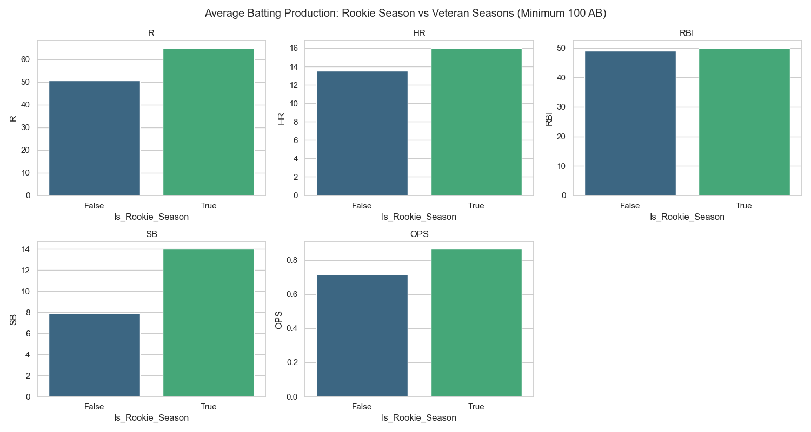
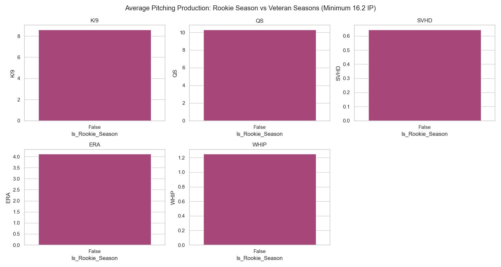

## Project Overview
Is it mathematically sound to intentionally draft rookies in a standard 5x5 Head-to-Head Fantasy Baseball league? We crossed daily MLB box scores from 2023-2025 against ESPN historical data logs to definitively map true categorical value-add for rookie seasons, comparing them entirely against an average veteran baseline.

---

### Key Features
- **Historical Age Mapping**: Dynamically generated via `pandas.read_html` scrapes from ESPN's legacy stat logs to determine every player's exact `Rookie_Year` constraint.
- **True Box Score Evaluation**: Bypassing point projections, players were strictly assessed at a per-category level (R, HR, RBI, SB, OPS; K/9, QS, SVHD, ERA, WHIP).
- **Veterans vs. Rookies Benchmark**: Minimum thresholds of 100 ABs (Hitters) or 16.2 IP (Pitchers) isolated true everyday contributors from September call-up noise.

---

### Findings & Charts

#### 1. Batting Statistics
At the aggregate level, the typical rookie season naturally falls behind an eligible veteran due to raw playing time limitations, slumps, and platoon adjustments. Across 2023-2025 (minimum 100 ABs), the Average Veteran produces:
- **.700 OPS** | **12.5 HR** | **47.6 Runs** | **45.8 RBI** | **7.8 SB**

Conversely, aggregate rookie averages lagged structurally across counting stats. 

#### 2. The Elite Exception
However, the top echelon of prospects in 2024 matched or violently exceeded positional baselines, proving that gambling on undisputed top-10 system bats operates flawlessly within 5x5 restrictions:

| Rank | Player Name | Rookie Year | Runs | HR | RBI | SB | OPS | +/- Vet OPS |
|:---:|:---|:---:|:---:|:---:|:---:|:---:|:---:|:---:|
| **1** | Tyler Fitzgerald | 2024 | 53 | 15 | 34 | 17 | **.831** | + .131 |
| **2** | Jackson Merrill | 2024 | 77 | 24 | 90 | 16 | **.826** | + .126 |
| **3** | Colton Cowser | 2024 | 77 | 24 | 69 | 9 | **.768** | + .068 |
| **4** | Wyatt Langford | 2024 | 74 | 16 | 74 | 19 | **.740** | + .040 |
| **5** | Masyn Winn | 2024 | 85 | 15 | 57 | 11 | **.730** | + .030 |

#### 3. Pitching Categories
For pitching prospects, strict innings restrictions and bullpen role adjustments inherently suppress traditional counting values like Quality Starts (QS) and Saves/Holds (SVHD). But raw, elite strikeout stuff translates immediately to the majors, positioning rookie **K/9** ratios to easily combat or surpass the veteran average despite the lowered usage.

---

#### TODO
- [x] Initial draft
- [x] Add code snippets
- [x] Add example images
- [x] Spell check

---

[Home](https://pjrigali.github.io)

*Last Updated: 2026-03-24*
