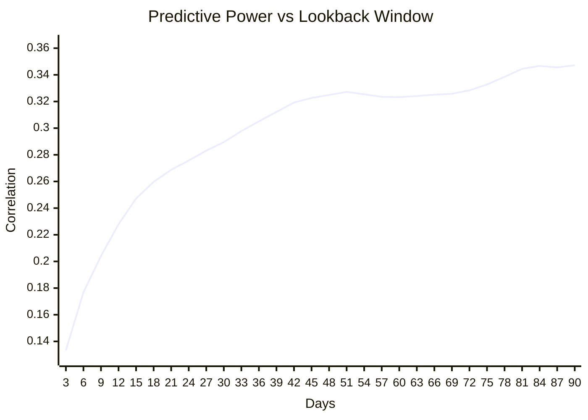
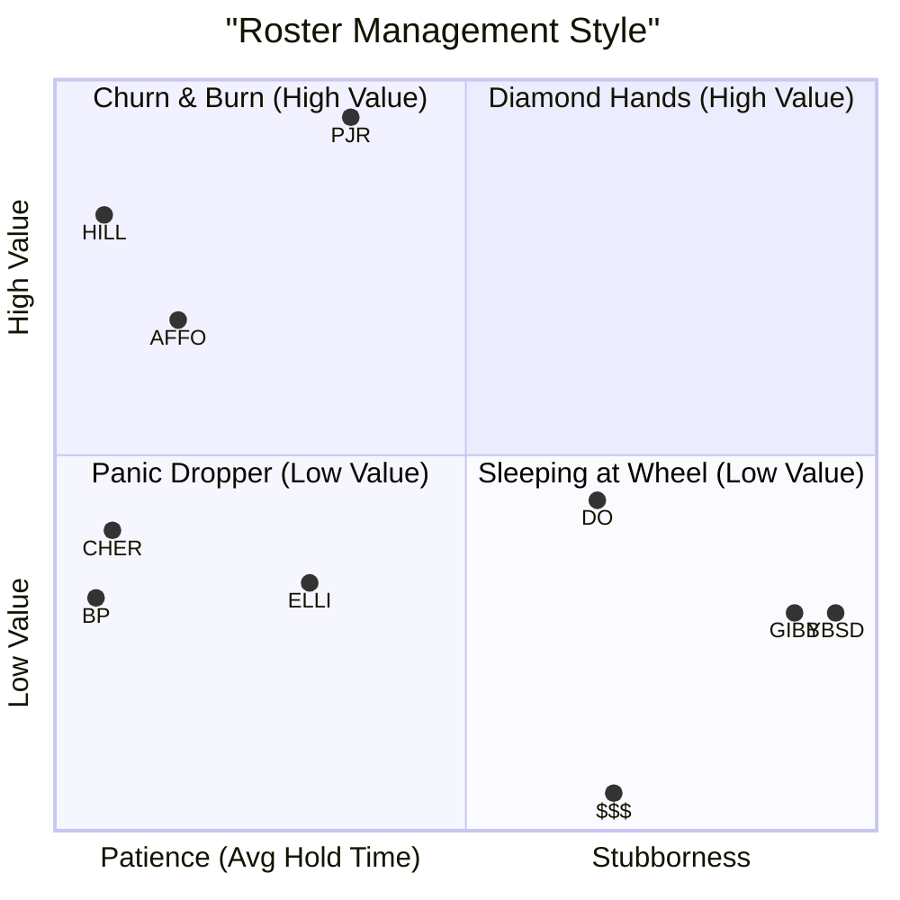

## League-Wide Roster Analysis

After auditing my own team, I expanded the analysis to all 10 teams in the league to identify the "Optimal Strategy" for our specific league settings.

I tested evaluation windows from **3 to 90 days** and correlated roster moves with final team success.

[< Back to Team PJR Audit](pages/18_Fantasy_Baseball_Roster_Audit_2025.md)

---

### 1. The Optimal Lookback Window

One of the hardest questions in fantasy is: *"How much recent performance history matters?"*

I calculated the predictive power (correlation with future performance) for lookback windows ranging from 3 to 90 days across the entire league.

**Winner: 42 Days**
While a 90-day window technically had the highest correlation, a **42-day window** (6 weeks) captures **92%** of the predictive power but allows you to react nearly **7 weeks** faster.

**Key Takeaway**: Don't overreact to a bad week (3-15 days is noise). But if a player has been bad for 6 weeks, they are likely to stay bad.

---

### 2. Roster Management Styles

I analyzed the "Manager DNA" of every team by looking at two metrics:
1.  **Churn Rate**: How many adds per week?
2.  **Patience**: How long do they hold a player before dropping? (Avg Hold Days)

#### The "Churn" Correlation
There is a significant positive correlation (`+0.39`) between **Churn** and **Success**. Teams that made more moves generally accrued more value. In contrast, "Patience" was negatively correlated (`-0.47`) with success.

**Quadrant Analysis**:
- **Top Left (High Value, High Churn)**: This is the sweet spot. Teams like **HILL** and **AFFO** lived here.
- **Top Right (High Value, High Patience)**: **PJR** (Me) is the outlier here. High value despite stubbornly holding players. This indicates a dominant draft class.
- **Bottom Right (Low Value, High Patience)**: The "Sleeping at the Wheel" quadrant. Teams like **DO**, **YBSD**, and **GIBB** held players for 100+ days and finished at the bottom.

---

### 3. Member Breakdown & Optimal Benchmarks

Based on the **Top 3 Teams**, the "Optimal" strategy for our league is:
- **Target Churn**: `2.2` Adds per Week.
- **Target Hold Limit**: `~60` Days for underperformers.

| Team | Total Value | Adds/Week | vs Optimal | Avg Hold |
|---|---|---|---|---|
| **PJR** (Me) | **1385.6** | 1.2 | -1.0 (Too Passive) | 82.0d |
| **HILL** | 1271.4 | **3.1** | +0.9 (Aggressive) | **45.4d** |
| **AFFO** | 1143.9 | 2.3 | +0.1 (Optimal) | 56.7d |
| **DO** | 926.0 | 0.5 | -1.8 | 117.1d |
| **CHER** | 889.2 | 2.8 | +0.6 | 47.2d |
| **ELLI** | 826.5 | 1.4 | -0.8 | 75.6d |
| **BP** | 809.5 | 3.3 | +1.0 | 44.6d |
| **YBSD** | 788.8 | 0.1 | -2.1 | 152.2d |
| **GIBB** | 788.4 | 0.3 | -1.9 | 146.4d |
| **$$$** | 574.3 | 0.5 | -1.8 | 120.1d |

---

[Home](https://pjrigali.github.io)

*Last Updated: 2026-02-16*
